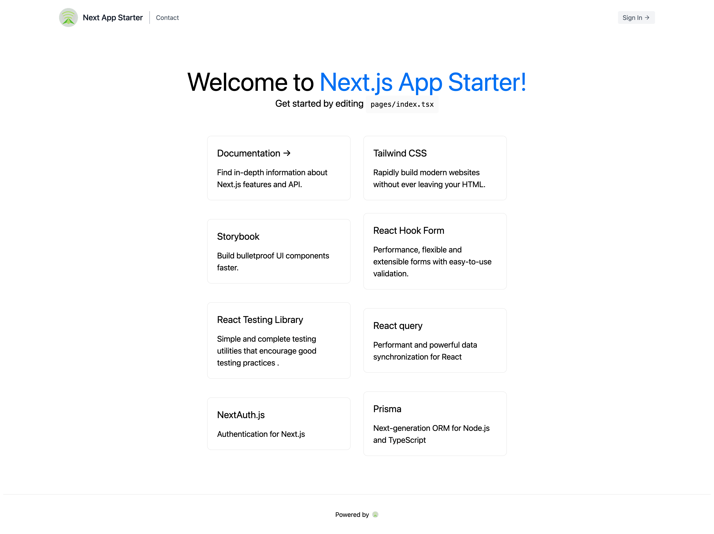

# Welcome to next-app-starter 👋
<!-- ALL-CONTRIBUTORS-BADGE:START - Do not remove or modify this section -->
[](#contributors-)
<!-- ALL-CONTRIBUTORS-BADGE:END -->


[](https://twitter.com/jellydn)

> Another awesome starter for your app

[](https://www.youtube-nocookie.com/embed/videoseries?list=PLOdXIcVPTyB_2IiS36upNkEw2fLhyb5D6)

## 🏠 [Homepage](https://github.com/jellydn/next-app-starter)

### ✨ [Demo](https://next-app-starter.vercel.app)



## 💻 Stack

-   [NextJS: the React Framework for Production](https://nextjs.org/docs)
-   [Tailwindcss: rapidly build modern websites without ever leaving your HTML](https://tailwindcss.com/)
-   [shadcn/ui: Beautifully designed components built with Radix UI and Tailwind CSS.](https://github.com/shadcn/ui)
-   [Jotai: primitive and flexible state management for React.](https://docs.pmnd.rs/jotai/introduction)
-   [Prisma: next-generation ORM for Node.js and TypeScrip](https://www.prisma.io/)
-   [NextAuth.js: Authentication for Next.js](https://next-auth.js.org/v3/getting-started/introduction)
-   [next-validations: NextJS API Validations, support Yup, Fastest-Validator, Joi, and more](https://next-validations.productsway.com/)
-   [zod: TypeScript-first schema validation with static type inference](https://github.com/colinhacks/zod)
-   [consola: Elegant Console Logger for Node.js and Browser 🐨](https://github.com/unjs/consola)
-   [Storybook: build bulletproof UI components faster](https://storybook.js.org)
-   [React-hook-form: performance, flexible and extensible forms with easy-to-use validation](https://www.react-hook-form.com/)
-   [react-testing: simple and complete testing utilities that encourage good testing practices](https://testing-library.com/)
-   [React-query: performant and powerful data synchronization for React](https://react-query.tanstack.com/)
-   And other standard tools as [Eslint](https://eslint.org/), [Prettier](https://prettier.io/), [nano-staged](https://github.com/usmanyunusov/nano-staged)

## 📝 Project Summary

- [**app**](app): Main application logic and entry point.
- [**components**](components): Reusable UI components.
- [**pages**](pages): Individual pages/views of the application.
- [**prisma**](prisma): Database ORM and migration scripts.
- [**public**](public): Static assets accessible to the public.
- [**store**](store): State management for the application.
- [**tests**](tests): Unit and integration tests.
- [**types**](types): Custom TypeScript types and interfaces.
- [**storybook**](storybook): Component library and documentation.
- [**.github/workflows**](.github/workflows): CI/CD workflows for GitHub Actions.

## Install

```sh
yarn install
```

## Usage

Create .env file base on .env.example then run below command

```sh
yarn dev
```

## Run tests

```sh
yarn test
```

## Run storybook

```sh
yarn storybook
```

## 📄 License

This project is licensed under the **MIT License** - see the [**MIT License**](https://github.com/jellydn/next-app-starter/blob/main/LICENSE) file for details.

## Author

-   Website: https://productsway.com/
-   Twitter: [@jellydn](https://twitter.com/jellydn)
-   Github: [@jellydn](https://github.com/jellydn)

## Stargazers 🌟

[](https://github.com/jellydn/next-app-starter/stargazers)

## Show your support

[](https://ko-fi.com/dunghd)
[](https://paypal.me/dunghd)
[](https://www.buymeacoffee.com/dunghd)

Give a ⭐️ if this project helped you!

## Contributors ✨

Thanks goes to these wonderful people ([emoji key](https://allcontributors.org/docs/en/emoji-key)):

<!-- ALL-CONTRIBUTORS-LIST:START - Do not remove or modify this section -->
<!-- prettier-ignore-start -->
<!-- markdownlint-disable -->
<table>
  <tbody>
    <tr>
      <td align="center" valign="top" width="14.28%"><a href="https://productsway.com/"><br /><sub><b>Dung Duc Huynh (Kaka)</b></sub></a><br /><a href="https://github.com/jellydn/next-app-starter/commits?author=jellydn" title="Code">💻</a> <a href="https://github.com/jellydn/next-app-starter/commits?author=jellydn" title="Documentation">📖</a></td>
      <td align="center" valign="top" width="14.28%"><a href="https://mike-hoang-dev.vercel.app/"><br /><sub><b>Mike Hoang</b></sub></a><br /><a href="https://github.com/jellydn/next-app-starter/commits?author=mikah13" title="Code">💻</a></td>
      <td align="center" valign="top" width="14.28%"><a href="https://github.com/salmansheri"><br /><sub><b>Salman Sheriff</b></sub></a><br /><a href="https://github.com/jellydn/next-app-starter/commits?author=salmansheri" title="Code">💻</a></td>
    </tr>
  </tbody>
</table>

<!-- markdownlint-restore -->
<!-- prettier-ignore-end -->

<!-- ALL-CONTRIBUTORS-LIST:END -->

This project follows the [all-contributors](https://github.com/all-contributors/all-contributors) specification. Contributions of any kind welcome!
